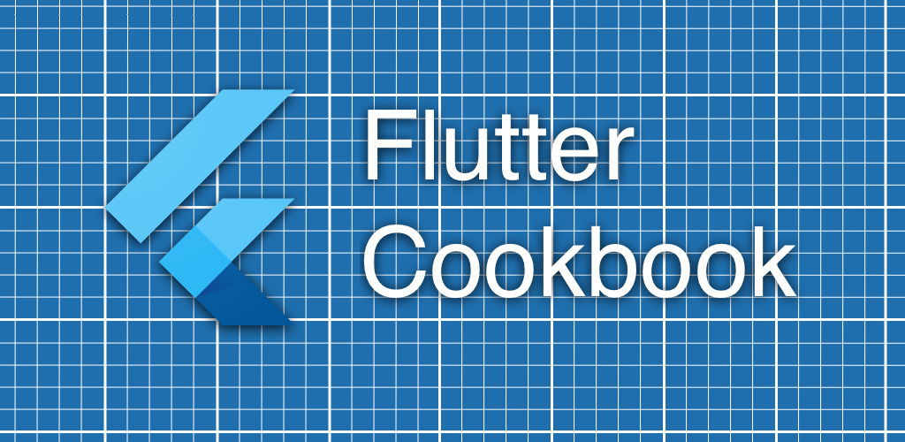
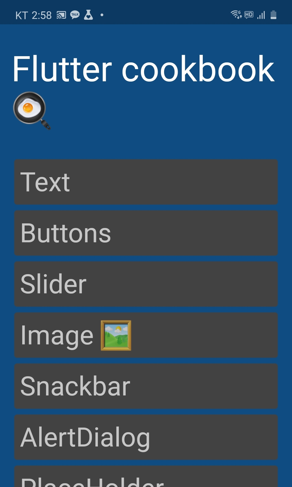

# Flutter Cookbook

Flutter cookbook app

Play store: Uploading now
App store: Uploading  
You can view web build by here: https://zimins.github.io/flutter_cookbook/#/

Its a Flutter example app. 

* Various type of widget usage.
* Fully opened code. 

### Loves feedback!

* Please request new feaure by issue or email.
* Add new demo by yourself by fork & pull request.




### Screenshots 



---------

## [fastlane match](https://docs.fastlane.tools/actions/match/)

This repository contains all your certificates and provisioning profiles needed to build and sign your applications. They are encrypted using OpenSSL via a passphrase.

**Important:** Make sure this repository is set to private and only your team members have access to this repo.

Do not modify this file, as it gets overwritten every time you run _match_.

### Installation

Make sure you have the latest version of the Xcode command line tools installed:

```
xcode-select --install
```

Install _fastlane_ using

```
[sudo] gem install fastlane -NV
```

or alternatively using `brew install fastlane`

### Usage

Navigate to your project folder and run

```
fastlane match appstore
```

```
fastlane match adhoc
```

```
fastlane match development
```

```
fastlane match enterprise
```

For more information open [fastlane match git repo](https://docs.fastlane.tools/actions/match/)

### Content

#### certs

This directory contains all your certificates with their private keys

#### profiles

This directory contains all provisioning profiles

---

For more information open [fastlane match git repo](https://docs.fastlane.tools/actions/match/)
